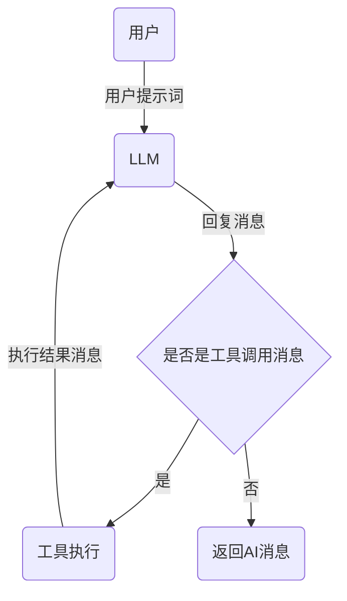

```mermaid
flowchart TB
user(用户)
llm(LLM)
tool(工具执行)
is_tool_use{是否是工具调用消息}
finish(返回AI消息)

user -->|用户提示词| llm
llm -->|回复消息| is_tool_use
is_tool_use -->|是| tool
tool -->|执行结果消息| llm
is_tool_use -->|否| finish
```